## 1. Loading Things: \

#### 1.1: Loading Packages \
Load in any and all packages required to manipulate, transform, and illustrate the data given.

```r
#Data:
library(cancensus)     #Package of Canadian census data to be used for assignment
```

```
## Warning: package 'cancensus' was built under R version 4.3.2
```

```r
#Functional:
library(tidyverse)     #Package to process our data, stylized formation
```

```
## Warning: package 'tidyverse' was built under R version 4.3.2
```

```
## Warning: package 'ggplot2' was built under R version 4.3.3
```

```
## Warning: package 'purrr' was built under R version 4.3.2
```

```
## Warning: package 'forcats' was built under R version 4.3.2
```

```
## ── Attaching core tidyverse packages ──────────────────────── tidyverse 2.0.0 ──
## ✔ dplyr     1.1.3     ✔ readr     2.1.4
## ✔ forcats   1.0.0     ✔ stringr   1.5.0
## ✔ ggplot2   3.5.0     ✔ tibble    3.2.1
## ✔ lubridate 1.9.2     ✔ tidyr     1.3.0
## ✔ purrr     1.0.2     
## ── Conflicts ────────────────────────────────────────── tidyverse_conflicts() ──
## ✖ dplyr::filter() masks stats::filter()
## ✖ dplyr::lag()    masks stats::lag()
## ℹ Use the conflicted package (<http://conflicted.r-lib.org/>) to force all conflicts to become errors
```

```r
library(magrittr)      #Package to help coding sequencing 
```

```
## 
## Attaching package: 'magrittr'
## 
## The following object is masked from 'package:purrr':
## 
##     set_names
## 
## The following object is masked from 'package:tidyr':
## 
##     extract
```

```r
library(janitor)       #Package for 'clean_names()' function
```

```
## Warning: package 'janitor' was built under R version 4.3.2
```

```
## 
## Attaching package: 'janitor'
## 
## The following objects are masked from 'package:stats':
## 
##     chisq.test, fisher.test
```

```r
library(sf)            #Package to work and plot with spatial data files
```

```
## Warning: package 'sf' was built under R version 4.3.3
```

```
## Linking to GEOS 3.11.2, GDAL 3.8.2, PROJ 9.3.1; sf_use_s2() is TRUE
```

```r
#Aesthetics:
library(ggplot2)       #Package to generate plotted data
library(patchwork)     #Package for extensive plotted data configuration 
```

```
## Warning: package 'patchwork' was built under R version 4.3.2
```

```r
library(cowplot)       #Package to use a specific function
```

```
## Warning: package 'cowplot' was built under R version 4.3.3
```

```
## 
## Attaching package: 'cowplot'
## 
## The following object is masked from 'package:patchwork':
## 
##     align_plots
## 
## The following object is masked from 'package:lubridate':
## 
##     stamp
```

```r
library(animation)     #Package to generate animations with plots 
```

```
## Warning: package 'animation' was built under R version 4.3.3
```

```r
library(gganimate)     #Package to generate animations with ggplots 
```

```
## Warning: package 'gganimate' was built under R version 4.3.3
```

```r
library(ggthemes)      #Package for extra themes, scales, and geoms for plotted data
```

```
## Warning: package 'ggthemes' was built under R version 4.3.2
```

```
## 
## Attaching package: 'ggthemes'
## 
## The following object is masked from 'package:cowplot':
## 
##     theme_map
```

```r
library(RColorBrewer)  #Package to colour plots

library(here)          #Package to set working directory via `.Rproj`
```

```
## here() starts at C:/Users/jkoza/Documents/GRADUATE SCHOOL/2. COURSEWORK/GG606/GG606_Assignment_2_2.0
```

```r
getwd()                #Function to affirm working directory 
```

```
## [1] "C:/Users/jkoza/Documents/GRADUATE SCHOOL/2. COURSEWORK/GG606/GG606_Assignment_2_2.0/02_rmarkdown"
```

#### 1.2: Loading Data 
The data being used here is an R package titled `cancensus` but requires use of an API key (since it is a working library package). We have set a local cache path within this `.Rproj` in order to draw this information much faster, and avoid maxing out our API limits (impossible). \

*Side note: `install=TRUE` was causing issues, so this line of code is being run each time without it... no more 'overwrite' messages.* 

```r
set_cancensus_api_key('CensusMapper_bae5c1c5a3d31a162c898f63dd424bb3')
```

```
## API key set for duration of session. To install your API key for use across sessions, run this function with `install = TRUE`.
```

```r
Sys.getenv("CM_API_KEY")        #confirm API is registering
```

```
## [1] "CensusMapper_bae5c1c5a3d31a162c898f63dd424bb3"
```

```r
set_cancensus_cache_path('01_rawdata') #set local cache path to store data pulled
```

```
## Cache set for duration of session. To permanently add your cache path for use across sessions, run this function with install = TRUE.
```

```
## [1] "01_rawdata"
```

```r
Sys.getenv("CM_CACHE_PATH")     #confirm cache patch saved to local data folder
```

```
## [1] "01_rawdata"
```

________________________________________________________________________________
## 2. Manipulating Data: \

#### 2.1: Reviewing The Dataset(s) \
There are a few conditions which must be met in order to successfully complete this assignment: \
1. has a name that starts with the same letter as your first name or last name (JK); \
2. is comprised of at least 30 geographic units; \
3. is somewhere that you have not personally visited and; \
4. involves at least three census dates \


Firstly, we need to see what kind of data is accessible to us within the entire `cancensus` data package of each Canadian census year (1996, 2001, 2006, 2011, 2016, and 2021). I have created these into new data frame objects, but this is just a personal preference in order to more easily re-call upon these vectors and the data columns that they contain. It appears that with each year more data variables were collected with each census date (with the exception of 2001). This makes sense as the ease of accessibility and better record collection practices throughout time are implemented. \

*Side note: if we wanted to do a longer time series we would filter and include only columns that are contained within the 1996 census... if we do not care or are only interested in variables that do not appear earlier within the census history, obviously we would not.*

```r
vect1996=list_census_vectors("CA1996")   #1,858 rows of data columns
vect01=list_census_vectors("CA01")       #1,725 rows of data columns
vect06=list_census_vectors("CA06")       #2,175 rows of data columns
vect11=list_census_vectors("CA11")       #3,875 rows of data columns
vect16=list_census_vectors("CA16")       #6,623 rows of data columns
vect21=list_census_vectors("CA21")       #7,709 rows of data columns
```


According to condition one, this assignment must be based on geographic locations that start with the first letter of my given or surname. So, next I want to see what locations within Canada either start with a "J" or "K" and if a particular geographic region appears within all census years, or not. \

I first created a new column for each census regions list to denote what year the data came from and omitted columns that I didn't care about (also no `'duplicate.x'` cols etc.). Since each 'newly' created data set columns were organized in the same order, and I had manually created a new `census_year` column which depicted what year the data came from, I was able to use the `bind_rows` function. Had I **not** generated this new column ahead of time, I would have had to have added additional steps that would have automatically done this, but this way was much easier. 

```r
#Year 1996
CA1996_regions=list_census_regions("CA1996") %>%       #create data frame object
  mutate(census_year="CA1996") #%>%                    #create new col w/ census year
```

```
## Querying CensusMapper API for regions data...
```

```r
#Year 2001
CA01_regions=list_census_regions("CA01") %>%
  mutate(census_year="CA01") 
```

```
## Querying CensusMapper API for regions data...
```

```r
#Year 2006
CA06_regions=list_census_regions("CA06") %>%
  mutate(census_year="CA06")
```

```
## Querying CensusMapper API for regions data...
```

```r
#Year 2011   
CA11_regions=list_census_regions("CA11") %>%
  mutate(census_year="CA11") 
```

```
## Querying CensusMapper API for regions data...
```

```r
#Year 2016
CA16_regions=list_census_regions("CA16") %>%
  mutate(census_year="CA16") 
```

```
## Querying CensusMapper API for regions data...
```

```r
#Year 2021
CA21_regions=list_census_regions("CA21") %>%
  mutate(census_year="CA21") 
```

```
## Querying CensusMapper API for regions data...
```

```r
#Create one new data frame with all census data years by plopping one year after the year on top of each other sequentially and assign it to a data frame name generating a callable object.
all_regions <-                        
  bind_rows(CA1996_regions, CA01_regions, CA06_regions, 
            CA11_regions, CA16_regions, CA21_regions)
```

Condition three states that any location visited by the coder (i.e., me) cannot be used for this assessment. Since I live in, and have therefore visited, the Kitchener-Waterloo tri-state area this location alongside others must be removed from our regional data set. 

```r
all_regions_JK=all_regions %>%                            #create new data frame object
  filter(str_starts(name, "J")|str_starts(name, "K")) %>% #only places with "J" or "K"
  arrange(name) %>%                                       #alphabetized by name
  filter(!(name %in% c("Kelowna", "Kenora", "Kenora, Unorganized", "Kitchener", "Kitchener - Cambridge - Waterloo"))) %>%                 #remove these locations
#Then I wanted to see which of these locations had the highest population among them
  arrange(desc(pop)) %>%    #undoes previous `arrange()` bc sorted by highest population
glimpse()
```

```
## Rows: 1,266
## Columns: 9
## $ region           <chr> "35521", "35521", "35521", "35521", "35521", "3510010…
## $ name             <chr> "Kingston", "Kingston", "Kingston", "Kingston", "King…
## $ level            <chr> "CMA", "CMA", "CMA", "CMA", "CMA", "CSD", "CSD", "CSD…
## $ pop              <int> 172546, 161175, 159561, 152358, 146838, 132485, 12379…
## $ municipal_status <chr> "B", "B", "B", "B", "B", "CY", "CY", "CY", "CY", "C",…
## $ CMA_UID          <chr> NA, NA, NA, NA, NA, "35521", "35521", "35521", "35521…
## $ CD_UID           <chr> NA, NA, NA, NA, NA, "3510", "3510", "3510", "3510", "…
## $ PR_UID           <chr> "35", "35", "35", "35", NA, "35", "35", "35", "35", "…
## $ census_year      <chr> "CA21", "CA16", "CA11", "CA06", "CA01", "CA21", "CA16…
```

It appears as though the geographic region of Kingston, ON consistently had the highest population count(s) throughout census years 2001-2021. However, I quickly double checked to see if any population data from the 1996 census year existed but for some reason was just not quite as high. \
This did in fact return a search hit, and since Kingston is a.) a geographic region sampled throughout all available census years b.) is a place that I have *not* visited c.) starts with the first letter of my surname and d.) has (mostly) the highest population counts for a location meeting the above criteria (and over 30 geographic units), I chose to focus my population analysis on this region. 


```r
all_regions_JK %>%
  filter(name=="Kingston", census_year== "CA1996")
```

```
## # A tibble: 3 × 9
##   region  name    level   pop municipal_status CMA_UID CD_UID PR_UID census_year
##   <chr>   <chr>   <chr> <int> <chr>            <chr>   <chr>  <chr>  <chr>      
## 1 3510011 Kingst… CSD   55947 C                35521   3510   35     CA1996     
## 2 3510009 Kingst… CSD   43756 TP               35521   3510   35     CA1996     
## 3 1305014 Kingst… CSD    2873 PAR              13310   1305   13     CA1996
```

```r
#Slim down the data frame even further to only contain region area codes for the city of Kingston, only with census years 2001-2021 (check that they are the same?).. I removed 1996 from the df after the following section did not contain education data
all_regions_Kingston=all_regions_JK %>%
  filter(name=="Kingston") %>%
  filter(census_year!="CA1996") %>%
  arrange(census_year) 
```


#### 2.2: Composing The Main Dataset(s) \

Since I have chosen to look at changes in population demographics related to Kingston, ON and it includes data from the 1996 census, this somewhat limits the type of data that we are able to look at over time. However, based on how overwhelming all of the new data variables that are available to us since 2011 (3,000+), this is now much easier to narrow down on what is accessible to us over time. Here is where one would look at all of the variables collected from the 1996 census and go, "Okay, so what is it that I actually wanna know? What kind of story am I gonna try and tell with this data? Is there one? Where is it and with what?" \

What I knew of Kingston consisted of not much, only that there were a couple of universities located there, based on three other MSc/PhD graduate students I had met in my travels. After a quick google search, it appears that Kingston apparently has more PhD holders per capita than any other major Canadian city [(The Globe and Mail 2022).](https://www.theglobeandmail.com/business/adv/article-kingston-ontario-a-small-place-with-big-city-features/) So assuming that I want to look at stuff related to this, I needed to figure out what information vectors were available to me based on this general topic. \

Looking at the data and variables available to us in 1996 were... not very impressive. I was not very pleased with them, especially after looking at all of the different and expansive data available from the 2001 census. Once I saw all of these vectors detailing post secondary qualifications and degree topics I knew I wanted to cut out 1996 from the analysis. Sorry not sorry. Here, I would start building some data frames that I would want to use to illustrate this data **at the CMA regional level to then be broken down into CSD and DAs.** \


```r
#Find any census topic from 2001 that relates to education for any gender or age.. I later added the sub_vectors for males and females to this dataset afterwards
CA01_ed_vect=find_census_vectors("education", dataset="CA01", type=c("total","male", 
                                  "female"), query_type="keyword", 
                                 interactive=FALSE)              #returns 54 vec
#Search  function did not return all results when filtering 'education' from `vect01`

#Find any census topic from 2006 that relates to education for any gender or age
CA06_ed_vect=find_census_vectors("education", dataset="CA06", type=c("total","male", 
                                  "female"), query_type="keyword", 
                                 interactive=FALSE)              #returns 96 vec
#Find any census topic from 2011 that relates to education for any gender or age
CA11_ed_vect=find_census_vectors("education", dataset="CA11", type=c("total","male", 
                                  "female"), query_type="keyword", 
                                 interactive=FALSE)             #returns 126 vec
#Find any census topic from 2016 that relates to education for any gender or age
CA16_ed_vect=find_census_vectors("education", dataset="CA16", type=c("total","male", 
                                  "female"), query_type="keyword", 
                                 interactive=FALSE)             #returns 549 vec
#Find any census topic from 2021 that relates to education for any gender or age
CA21_ed_vect=find_census_vectors("education", dataset="CA21", type=c("total","male", 
                                  "female"), query_type="keyword", 
                                 interactive=FALSE)             #returns 696 vec
#Vectors related to this search increase with census years...
```

*Side note: The tricky thing to look out for are vectors that are sub-vectors of initial parent ones... Ex: 'Total population 20 years and over by highest level of schooling' (`v_CA01_1384`) is an initial parent vector that gives birth to a series of sub-vectors like 'Grades 9 to 13' (`v_CA01_1386`), that then trickle down to even DEEPER sub-vectors... like 'With/Without high school graduation certificate' (`v_CA01_1388`/`v_CA01_1387`). This is also only a case and point example for 2001.* \

Ugh. I have a feeling that I am going to have to be pulling out specific vectors from each census year because a.) vectors are not consistent throughout years (ex. people who have a master's degree have different vector codes) and b.) details or descriptions surrounding the same thing are different too.  


```r
#I thought it was important to keep the parent_vector information handy in case I wanted to go back and reference where those numbers came from. Had to first defineand create the object before merging and rearranging though. 

#Add in `parent_vector` col to previous 2001 education vector data set
CA01_ed_vect=CA01_ed_vect %>%                           #overwrite previous object
  mutate(merge(CA01_ed_vect, vect01[, c("vector", "parent_vector")], 
               by="vector")) %>%                  #merge by vector and add new col
  select(vector, type, label, parent_vector, everything())            #reorder cols
#Add in `parent_vector` col to previous 2006 education vector data set
CA06_ed_vect=CA06_ed_vect %>%                     
  mutate(merge(CA06_ed_vect, vect06[, c("vector", "parent_vector")], 
               by="vector")) %>%                  
  select(vector, type, label, parent_vector, everything()) 
#Add in `parent_vector` col to previous 2011 education vector data set
CA11_ed_vect=CA11_ed_vect %>%                    
  mutate(merge(CA11_ed_vect, vect11[, c("vector", "parent_vector")], 
               by="vector")) %>%                  
  select(vector, type, label, parent_vector, everything()) 
#Add in `parent_vector` col to previous 2016 education vector data set
CA16_ed_vect=CA16_ed_vect %>%                    
  mutate(merge(CA16_ed_vect, vect16[, c("vector", "parent_vector")], 
               by="vector")) %>%                  
  select(vector, type, label, parent_vector, everything()) 
#Add in `parent_vector` col to previous 2021 education vector data set
CA21_ed_vect=CA21_ed_vect %>%                    
  mutate(merge(CA21_ed_vect, vect21[, c("vector", "parent_vector")], 
               by="vector")) %>%                  
  select(vector, type, label, parent_vector, everything()) 

#Note: the merge made additional parent vector cols .x and .y but because they are the same and it doesn't really matter + I was too lazy to code them out, I just left them as is. 
```

Now we have to take all of the vectors we identified in the previous section and get the corresponding population data from the desired region (Kingston). I have made data frames for population data broken down by CSD regions (not very detailed or descriptive due to a lack of total regions within the area), and DAs (more detailed, can see more of a neighborhood effect within each CSD).  

*Side note: could not get the `mutate(census_year="CA11")` function to work in conjunction with `get_census()` most likely because it was pulling the data and making a new table... to then add onto though...?*


```r
#Get 2001 population data from selected vectors for the Kingston region at the CSD level
CA01_ed_CSD=get_census(dataset="CA01", regions=list(CMA="35521"), 
            vectors=c(CA01_ed_vect$vector), level="CSD")
```

```
## Reading vectors data from local cache.
```

```r
            #64 cols (10 given + 54 vectors) appears to have synced properly 
#Get 2006 population data from selected vectors for the Kingston region
CA06_ed_CSD=get_census(dataset="CA06", regions=list(CMA="35521"),
            vectors=c(CA06_ed_vect$vector), level="CSD")
```

```
## Reading vectors data from local cache.
```

```r
            #106 cols (10 given + 96 vectors)
#Get 2011 population data from selected vectors for the Kingston region
CA11_ed_CSD=get_census(dataset="CA11", regions=list(CMA="35521"), 
            vectors=c(CA06_ed_vect$vector), level="CSD")
```

```
## Reading vectors data from local cache.
```

```r
#Get 2016 population data from selected vectors for the Kingston region
CA16_ed_CSD=get_census(dataset="CA16", regions=list(CMA="35521"), 
            vectors=c(CA06_ed_vect$vector), level="CSD") 
```

```
## Reading vectors data from local cache.
```

```r
#Get 2021 population data from selected vectors for the Kingston region
CA21_ed_CSD=get_census(dataset="CA21", regions=list(CMA="35521"), 
            vectors=c(CA21_ed_vect$vector), level="CSD") 
```

```
## Reading vectors data from local cache.
```


```r
#I like having the data wide, but I need it to be long in order to more readily see the vectors so that I can pull whichever ones I want out + for plotting(?)

#Edit 2001 census education data into a more malleable form
CA01_ed_CSD_long=CA01_ed_CSD %>%                        #create new object
  clean_names() %>%                                     #clean col names
  pivot_longer(cols=!c(geo_uid, type, region_name, area_sq_km, population, dwellings, 
                         households, cd_uid, pr_uid, cma_uid), #all but NOT these cols
               names_to= "vector_des",
               values_to= "count") %>%
   mutate(vector_code=str_extract(vector_des, "^v_[^_]*_[0-9]+_"),#new col w/ code
          vector_des=str_remove(vector_des, "^v_[^_]*_[0-9]+_")) #remove from old col
#Edit 2006 census education data into a more malleable form
CA06_ed_CSD_long=CA06_ed_CSD %>%                       
  clean_names() %>%                                     
  pivot_longer(cols=!c(geo_uid, type, region_name, area_sq_km, population, dwellings, 
                         households, cd_uid, pr_uid, cma_uid), 
               names_to= "vector_des",
               values_to= "count") %>%
   mutate(vector_code=str_extract(vector_des, "^v_[^_]*_[0-9]+_"),
          vector_des=str_remove(vector_des, "^v_[^_]*_[0-9]+_")) 
#Edit 2011 census education data into a more malleable form
CA11_ed_CSD_long=CA11_ed_CSD %>%                       
  clean_names() %>%                                     
  pivot_longer(cols=!c(geo_uid, type, region_name, area_sq_km, population, dwellings, 
                         households, cd_uid, pr_uid, cma_uid), 
               names_to= "vector_des",
               values_to= "count") %>%
   mutate(vector_code=str_extract(vector_des, "^v_[^_]*_[0-9]+_"),
          vector_des=str_remove(vector_des, "^v_[^_]*_[0-9]+_")) 
#Edit 2016 census education data into a more malleable form
CA16_ed_CSD_long=CA16_ed_CSD %>%                       
  clean_names() %>%                                     
  pivot_longer(cols=!c(geo_uid, type, region_name, area_sq_km, population, dwellings, 
                         households, cd_uid, pr_uid, cma_uid), 
               names_to= "vector_des",
               values_to= "count") %>%
   mutate(vector_code=str_extract(vector_des, "^v_[^_]*_[0-9]+_"),
          vector_des=str_remove(vector_des, "^v_[^_]*_[0-9]+_")) 
#Edit 2021 census education data into a more malleable form
CA21_ed_CSD_long=CA21_ed_CSD %>%                       
  clean_names() %>%                                     
  pivot_longer(cols=!c(geo_uid, type, region_name, area_sq_km, population, dwellings, 
                         households, cd_uid, pr_uid, cma_uid), 
               names_to= "vector_des",
               values_to= "count") %>%
   mutate(vector_code=str_extract(vector_des, "^v_[^_]*_[0-9]+_"),
          vector_des=str_remove(vector_des, "^v_[^_]*_[0-9]+_")) 
```

*Side note: I was gonna be lazy and not use the `clean_names()` function... but then ran into an issue with 'Area (sq km)' which I would have otherwise have had to enter in as an expression, which would have been an absolute pain that I did not feel like getting into. I also had to somehow extract the vector code better than using the `<=?` method since there were so many underscores, which sucked, but appears to be working properly now.*


```r
#Get 2001 population data from selected vectors for the Kingston region at the DA level
CA01_ed_DA=get_census(dataset="CA01", regions=list(CMA="35521"), 
            vectors=c(CA01_ed_vect$vector), level="DA")
```

```
## Reading vectors data from local cache.
```

```r
#Get 2006 population data from selected vectors for the Kingston region
CA06_ed_DA=get_census(dataset="CA06", regions=list(CMA="35521"),
            vectors=c(CA06_ed_vect$vector), level="DA")
```

```
## Reading vectors data from local cache.
```

```r
#Get 2011 population data from selected vectors for the Kingston region
CA11_ed_DA=get_census(dataset="CA11", regions=list(CMA="35521"), 
            vectors=c(CA06_ed_vect$vector), level="DA")
```

```
## Reading vectors data from local cache.
```

```r
#Get 2016 population data from selected vectors for the Kingston region
CA16_ed_DA=get_census(dataset="CA16", regions=list(CMA="35521"), 
            vectors=c(CA06_ed_vect$vector), level="DA") 
```

```
## Reading vectors data from local cache.
```

```r
#Get 2021 population data from selected vectors for the Kingston region
CA21_ed_DA=get_census(dataset="CA21", regions=list(CMA="35521"), 
            vectors=c(CA21_ed_vect$vector), level="DA") 
```

```
## Reading vectors data from local cache.
```


```r
#Edit 2001 census education data into a more malleable form.. same thing as CSD
CA01_ed_DA_long=CA01_ed_DA %>%
  clean_names() %>%                                     #clean col names
  pivot_longer(cols=!c(geo_uid, type, region_name, area_sq_km, population, 
                       dwellings, households,  csd_uid, cd_uid, ct_uid, cma_uid),
               names_to= "vector_des",
               values_to= "count") %>%
   mutate(vector_code=str_extract(vector_des, "^v_[^_]*_[0-9]+_"),#new col w/ code
          vector_des=str_remove(vector_des, "^v_[^_]*_[0-9]+_")) #remove from old col
#Edit 2006 census education data into a more malleable form.. same thing as CSD
CA06_ed_DA_long=CA06_ed_DA %>%
  clean_names() %>%                                     
  pivot_longer(cols=!c(geo_uid, type, region_name, area_sq_km, population, 
                       dwellings, households,  csd_uid, cd_uid, ct_uid, cma_uid),
               names_to= "vector_des",
               values_to= "count") %>%
   mutate(vector_code=str_extract(vector_des, "^v_[^_]*_[0-9]+_"),
          vector_des=str_remove(vector_des, "^v_[^_]*_[0-9]+_")) 
#Edit 2011 census education data into a more malleable form.. same thing as CSD
CA11_ed_DA_long=CA11_ed_DA %>%
  clean_names() %>%                                     
  pivot_longer(cols=!c(geo_uid, type, region_name, area_sq_km, population, 
                       dwellings, households,  csd_uid, cd_uid, ct_uid, cma_uid),
               names_to= "vector_des",
               values_to= "count") %>%
   mutate(vector_code=str_extract(vector_des, "^v_[^_]*_[0-9]+_"),
          vector_des=str_remove(vector_des, "^v_[^_]*_[0-9]+_")) 
#Edit 2016 census education data into a more malleable form.. same thing as CSD
CA16_ed_DA_long=CA16_ed_DA %>%
  clean_names() %>%                                     
  pivot_longer(cols=!c(geo_uid, type, region_name, area_sq_km, population, 
                       dwellings, households,  csd_uid, cd_uid, ct_uid, cma_uid),
               names_to= "vector_des",
               values_to= "count") %>%
   mutate(vector_code=str_extract(vector_des, "^v_[^_]*_[0-9]+_"),
          vector_des=str_remove(vector_des, "^v_[^_]*_[0-9]+_")) 
#Edit 2021 census education data into a more malleable form.. same thing as CSD
CA21_ed_DA_long=CA21_ed_DA %>%
  clean_names() %>%                                     
  pivot_longer(cols=!c(geo_uid, type, region_name, area_sq_km, population, 
                       dwellings, households,  csd_uid, cd_uid, ct_uid, cma_uid),
               names_to= "vector_des",
               values_to= "count") %>%
   mutate(vector_code=str_extract(vector_des, "^v_[^_]*_[0-9]+_"),
          vector_des=str_remove(vector_des, "^v_[^_]*_[0-9]+_")) 
```


________________________________________________________________________________
## 3. Plotting Data: \

#### 3.1: Reviewing The Dataset(s)... Again \
Since we have successfully pulled and saved the data to our local cache (I hope), we can now actually look at the data across these census years and try to plot some stuff out. As I mentioned earlier, there is an issue with similar census data vectors that are essentially the same thing, but they go by different vectors or have been slightly modified in spirit (ex. number of people who have a master's degree). So here is where our plotting story begins. \

1. After looking at all of this data, my intuition would be to first look at general changes in education throughout the region over the years. Do we see more and more people throughout time getting higher and higher education levels? While a great place to start, this task was sadly too great for the amateur little coder (in this time frame). The first mission is to look at the popularity of bachelor degrees over time, which might have some relation to all of these PhDs that are supposedly here. \
2. Do we see a corresponding increase in PhDs appearing throughout time as well? When does this change in PhD holders occur? Has there been an increasing amount of people with bachelor degrees being granted, then into PhDs? Or do we think that we have external visitors coming to complete their research? \


#### Are There Changes in Post-Secondary Degree levels? \
As was mentioned, the main CSD and DA data sets need to be adjusted to meet each need... I am not sure how one would automate this process, since Statistics Canada themselves seem to choose whatever the hell it is that they want to call each census vector, and that they are not consistent throughout time (partially to denote census year).  Nonetheless, I sifted through each education census vector list and tried to find data that best corresponded to those who were awarded and are bachelor degree holders throughout each census year. However, the conditions change ever so slightly throughout each year (denoted below). 

**BACHELOR SECTION** \
- Since there are differences in between each census year (i.e., separation of bachelor degree holders within different age categories throughout time), I am going to amalgamate them since I personally don't really care what age category has more at this point in time, I just want to see if there is an overall change in bachelor degrees being held. Also, while plotting the number of bachelor degree holders over time is... interesting, it does not standardize nor account for the potential change in population influx over time. If we were to convert the number of degree holders per area over time into a percentage, it would be slightly more meaningful overtime to compare rates of change. \

- *Side note:* So, since I had noticed an error that I had made a little too late (error: over estimating bachelor, master, and PhDs held for 2011-2021 by summing the 'highest level of education 15 years and over' and 'highest level of education 25-65' assuming that the first vector includes the same values from the second) I could've merged all of this data together (since it was more consistent) and made a GIF plot within one frame. But alas. 

```r
#We can use the long education vector lists to find vectors that are best suited to our conditions. However, we still need to grab the affiliated shape files, which I did not do when pulling the CSD or DA data... whomp whomp. 

#2001 bachelor degree or higher for 20 yrs old+
CA01_bachelor=get_census(dataset='CA01', regions=list(CMA="35521"),
                         vectors=c("bachelor_degree_higher"="v_CA01_1397"), 
                     level='DA', quiet=TRUE, geo_format='sf', labels='short')
#2006 bachelor degree 15-24, 25-64, 65+
CA06_bachelor=get_census(dataset='CA06', regions=list(CMA="35521"),
                         vectors=c("bachelor_degree_15_24"= 
                        "v_CA06_1243","bachelor_degree_25_64"= "v_CA06_1257",
                         "bachelor_degree_65"="v_CA06_1271"),
                     level='DA', quiet=TRUE, geo_format='sf', labels='short')
#2011 bachelor degree 15+, 25-64 
#here I assume that '15 years or over' also includes the 25-65 bracket
CA11_bachelor=get_census(dataset='CA11', regions=list(CMA="35521"),
                         vectors=c("bachelor_degree_15"="v_CA11N_1795"), 
                     level='DA', quiet=TRUE, geo_format='sf', labels='short')
#2016 bachelor degree 15+, 25-64 
CA16_bachelor=get_census(dataset='CA16', regions=list(CMA="35521"),
                         vectors=c("bachelor_degree_15"="v_CA16_5081"), 
                     level='DA', quiet=TRUE, geo_format='sf', labels='short')
#2021 bachelor degree 15+, 25-64 
CA21_bachelor=get_census(dataset='CA21', regions=list(CMA="35521"),
                         vectors=c("bachelor_degree_15"="v_CA21_5850"), 
                     level='DA', quiet=TRUE, geo_format='sf', labels='short')
```


```r
#2001 only has one category... so no need for lots of maths
CA01_bachelor=CA01_bachelor %>%                       #overwrite previous df
  clean_names() %>%                                   #clean col names
  mutate(percentage=round((bachelor_degree_higher     #create proportion %
                           /(population))*100, 2)) %>%#idk why this creates a new col??
  select(population, bachelor_degree_higher, percentage, everything()) %>% #arrng cols
  mutate(census_year="CA01")                          #create census year col
#2006 we have to do some *additional*... maths *ba boom ching* because they divided highest level of education by distinct brackets rather than 15 years+
CA06_bachelor=CA06_bachelor %>%
  clean_names() %>%
  rowwise() %>%                                     #need function to apply across
  mutate(bachelor_degree_total=sum(bachelor_degree_15_24,     #sum all degree ages 
                                   bachelor_degree_25_64, 
                                   bachelor_degree_65,
                                   na.rm=TRUE)) %>%
  mutate(percentage=round((bachelor_degree_total         #create new proportion %  
                           /(population))*100, 2)) %>%
  select(population, bachelor_degree_15_24, bachelor_degree_25_64, bachelor_degree_65, 
         bachelor_degree_total, percentage, everything()) %>%     
  mutate(census_year="CA06") %>%
  ungroup()       #have to undo the `rowwise()` function because issues later on
#2011 same thing as 2001 census year except here onwards things become more standard in their age categories 
CA11_bachelor=CA11_bachelor %>%
  clean_names() %>%
  mutate(percentage=round((bachelor_degree_15/(population))*100, 2)) %>%
  select(population, bachelor_degree_15, percentage, everything()) %>%
  mutate(census_year="CA11") 
#2016...
CA16_bachelor=CA16_bachelor %>%
  clean_names() %>%
  mutate(percentage=round((bachelor_degree_15/(population))*100, 2)) %>%
  select(population, bachelor_degree_15, percentage, everything()) %>%
  mutate(census_year="CA16")
#2021
CA21_bachelor=CA21_bachelor %>%
  clean_names() %>%
  mutate(percentage=round((bachelor_degree_15/(population))*100, 2)) %>%
  select(population, bachelor_degree_15, percentage, everything()) %>%
  mutate(census_year="CA21") 
```


I had attempted to plot all of these individual figures into one grid plot (three cols by degree type x five rows by census year) but this... returned horrible results because it was just waaaay too small + something to do with the plot image size probably needed to be readjusted before this (they appeared square piror to `(pty="s")`?) but I'm also not sure if this has something to do with using the geospatial data. Alas. \
Code to generate a GIF from separate plots was found from [here.](https://community.rstudio.com/t/combining-multiple-plots-into-animation-within-r-markdown/63181) Since I did not render this graphic within one logical code chunk due to separate data frames (I could not determine how to best amalgamate the data frames into one prior to error discovery), this output does not generate within a knit html file, partially because it is undergoing a save function as well. My apologies for this. To view the static plots please visit the Appendix. To view the GIF, please navigate to the 'figures' folder within this repository. 


I want to now look at the master's and PhD data spatially as well to see if there is a similar change within the academic landscape to those with bachelor degrees, or if we suddenly see more of a dramatic increase (possible immigration) in PhD holders within the region. Much like with the bachelor degrees, the amount of granted master's/PhDs across age categories will be added together here for simplicity's sake then converted into a percentage. \
- **Additional note:** So, this is improper of me to do so, but I went back to also compute the master's data. In 2011 we see this large increase in 'PhD' holders, but rather these values also include those with a master's degree. So, I wanted to check and see if MSc level data could help explain that large increase (i.e., is it only so big because master's degrees also increase over time or have a large presence within the region?)
- This data is featured here prior to the PhD data and might appear... a little helter skeltery because of external restraints and starts to get a little sloppy because of increasing frantic-ness, but I wanted to include it. This data should be reviewed more thoroughly to determine quality and that things appear more or less as they should.  


**MASTER'S SECTION**

```r
#We can use the long education vector lists to find vectors that are best suited to our conditions. However, we still need to grab the affiliated shape files, which I did not do when pulling the CSD or DA data... whomp whomp. 

#2001 bachelor degree or higher for 20 yrs old+
#This data frame can actually stay the same and be reused, since it (unfortunately) includes all levels of higher post-secondary education.

#2006 master degree 15-24, 25-64, 65+
CA06_msc=get_census(dataset='CA06', regions=list(CMA="35521"),
                         vectors=c("msc_degree_15_24"= "v_CA06_1246",
                        "msc_degree_25_64"= "v_CA06_1260",
                         "msc_degree_65"="v_CA06_1274"),
                     level='DA', quiet=TRUE, geo_format='sf', labels='short')
#2011 only OVER A BACHELOR degree 15+, 25-64 (do not know if Master's or PhD)
CA11_msc=get_census(dataset='CA11', regions=list(CMA="35521"),
                         vectors=c("overbach_degree_15"="v_CA11N_1798"), 
                     level='DA', quiet=TRUE, geo_format='sf', labels='short')
#2016 master degree 15+, 25-64 
CA16_msc=get_census(dataset='CA16', regions=list(CMA="35521"),
                         vectors=c("msc_degree_15"="v_CA16_5090"), 
                     level='DA', quiet=TRUE, geo_format='sf', labels='short')
#2021 master degree 15+, 25-64 
CA21_msc=get_census(dataset='CA21', regions=list(CMA="35521"),
                         vectors=c("msc_degree_15"="v_CA21_5859"), 
                     level='DA', quiet=TRUE, geo_format='sf', labels='short')
```


```r
#2001 only has one category... so no need for lots of maths
#This year has its data sorted by 'bachelor degree or higher' so we keep it the same.

#Here I only changed the 'doctorate' to 'msc' so hopefully things are g//checking these overwritten df math+ % across CA06 and CA16 are good
#2006 we have to do some *additional*... maths *ba boom ching*
CA06_msc=CA06_msc %>%
  clean_names() %>%
  rowwise() %>%                                     #need function to apply across
  mutate(msc_degree_total=sum(msc_degree_15_24,     #sum all degree ages 
                                   msc_degree_25_64, 
                                   msc_degree_65,
                                   na.rm=TRUE)) %>%
  mutate(percentage=round((msc_degree_total         #create new proportion %  
                           /(population))*100, 2)) %>%
  select(population, msc_degree_15_24, msc_degree_25_64, msc_degree_65, 
         msc_degree_total, percentage, everything()) %>%   
  mutate(census_year="CA06") %>%
  ungroup()                             
#2011 same thing as 2001 census year except there is no differentiation between a Master's and PhD holder, only that it is above a bachelor degree  
CA11_msc=CA11_msc %>%
  clean_names() %>%
  mutate(percentage=round((overbach_degree_15/(population))*100, 2)) %>%
  select(population, overbach_degree_15, percentage, everything()) %>%
  mutate(census_year="CA11") 
#2016...
CA16_msc=CA16_msc %>%
  clean_names() %>%
  mutate(percentage=round((msc_degree_15/(population))*100, 2)) %>%
  select(population, msc_degree_15, percentage, everything()) %>%
  mutate(census_year="CA16") 
#2021
CA21_msc=CA21_msc %>%
  clean_names() %>%
  mutate(percentage=round((msc_degree_15/(population))*100, 2)) %>%
  select(population, msc_degree_15, percentage, everything()) %>%
  mutate(census_year="CA21")
```


**PhD SECTION**

```r
#We can use the long education vector lists to find vectors that are best suited to our conditions. However, we still need to grab the affiliated shape files, which I did not do when pulling the CSD or DA data... whomp whomp. 

#2001 bachelor degree or higher for 20 yrs old+
#This data frame can actually stay the same and be reused, since it (unfortunately) includes all levels of higher post-secondary education.

#2006 doctorate degree 15-24, 25-64, 65+
CA06_phd=get_census(dataset='CA06', regions=list(CMA="35521"),
                         vectors=c("doctorate_degree_15_24"= "v_CA06_1247",
                        "doctorate_degree_25_64"= "v_CA06_1261",
                         "doctorate_degree_65"="v_CA06_1275"),
                     level='DA', quiet=TRUE, geo_format='sf', labels='short')
#2011 only OVER A BACHELOR degree 15+, 25-64 (do not know if Master's or PhD)
CA11_phd=get_census(dataset='CA11', regions=list(CMA="35521"),
                         vectors=c("overbach_degree_15"="v_CA11N_1798"), 
                     level='DA', quiet=TRUE, geo_format='sf', labels='short')
#2016 doctorate degree 15+, 25-64 
CA16_phd=get_census(dataset='CA16', regions=list(CMA="35521"),
                         vectors=c("doctorate_degree_15"="v_CA16_5093"), 
                     level='DA', quiet=TRUE, geo_format='sf', labels='short')
#2021 doctorate degree 15+, 25-64 
CA21_phd=get_census(dataset='CA21', regions=list(CMA="35521"),
                         vectors=c("doctorate_degree_15"="v_CA21_5862"), 
                     level='DA', quiet=TRUE, geo_format='sf', labels='short')
```


```r
#2001 only has one category... so no need for lots of maths
#This year has its data sorted by 'bachelor degree or higher' so we keep it the same.

#2006 we have to do some *additional*... maths *ba boom ching*
CA06_phd=CA06_phd %>%
  clean_names() %>%
  rowwise() %>%                                     #need function to apply across
  mutate(doctorate_degree_total=sum(doctorate_degree_15_24,     #sum all degree ages 
                                   doctorate_degree_25_64, 
                                   doctorate_degree_65,
                                   na.rm=TRUE)) %>%
  mutate(percentage=round((doctorate_degree_total         #create new proportion %  
                           /(population))*100, 2)) %>%
  select(population, doctorate_degree_15_24, doctorate_degree_25_64, 
         doctorate_degree_65, doctorate_degree_total, percentage, everything()) %>%   
  mutate(census_year="CA06") %>%
  ungroup()                             
#2011 same thing as 2001 census year except there is no differentiation between a Master's and PhD holder, only that it is above a bachelor degree  
CA11_phd=CA11_phd %>%
  clean_names() %>%
  mutate(percentage=round((overbach_degree_15/(population))*100, 2)) %>%
  select(population, overbach_degree_15, percentage, everything()) %>%
  mutate(census_year="CA11") 
#2016...
CA16_phd=CA16_phd %>%
  clean_names() %>%
  mutate(percentage=round((doctorate_degree_15/(population))*100, 2)) %>%
  select(population, doctorate_degree_15, percentage, everything()) %>%
  mutate(census_year="CA16") 
#2021
CA21_phd=CA21_phd %>%
  clean_names() %>%
  mutate(percentage=round((doctorate_degree_15/(population))*100, 2)) %>%
  select(population, doctorate_degree_15, percentage, everything()) %>%
  mutate(census_year="CA21")
```


While the spatial data is interesting, we need something to more clearly assist with the change in proportion of degree holders over time, and arguably throughout the whole Kingston region- not just within DAs. Here, I take the previous bachelor, master, and PhD data frames for each census year and only keep the population and percentage data columns (dropping the shape files), while combining the total number of degree types held. I then merge all of the bachelor data together since they share similar columns and I don't need any of the associated geometry data, followed by combining all of the master's/PhD data together (respectively), then combine the three degree data frames (bachelor, master, PhD) together into one big happy data table (ugh).  


```r
#2001: this data frame will also be rerun with a phd name assigned to it
CA01_bachelor_proportion=CA01_bachelor %>%          #create new data frame object
  filter(region_name=="Kingston") %>%               #only use data from this CSD 
  mutate(population_sum=sum(population)) %>%        #new col for total DA populations
  mutate(bach_degree_sum=sum(bachelor_degree_higher, 
                             na.rm=TRUE)) %>% #new col total bach degrees throughout   
                          #ALL DAs... previous 'total bach' col added ACROSS ROWS!!!!
  mutate(percentage=round((bach_degree_sum/
                             (population_sum))*100, 2)) %>% #new col proportion % 
  mutate(census_year="2001") %>%                            #new col census year      
  mutate(deg_type="bachelor") %>%                           #new col degree type
  select(population_sum, bach_degree_sum, 
         percentage, deg_type, census_year, -geometry) %>%  #make ALL COLS SAME ORDER
  slice(1)                                      #only keep row one.. all the same- geo
#2006: the `bachelor_degree_total` col here is the sum of degrees across all age ranges within a particular DA.. however, summing this column up is equal to the same thing as summing all of the additional columns individually after coding the `ungroup()` function (was still doing `rowwise()` across.) I double checked these total values in excel and they seem fine. 
CA06_bachelor_proportion=CA06_bachelor %>%
  filter(region_name=="Kingston") %>%               
  mutate(population_sum=sum(population)) %>%        
  mutate(bach_degree_sum=sum(bachelor_degree_total, na.rm=TRUE)) %>%      
  mutate(percentage=round((bach_degree_sum/(population_sum))*100, 2)) %>% 
  mutate(census_year="2006") %>%                                
  mutate(deg_type="bachelor") %>%                           
  select(population_sum, bach_degree_sum, percentage, deg_type, census_year) %>%
  slice(1)
#2011: since we used the same total bach degree col title we can recopy main code. Checked total population/total degree sums * 100 = correct % for 2011 from CA11_bach
CA11_bachelor_proportion=CA11_bachelor %>%
  filter(region_name=="Kingston") %>%               
  mutate(population_sum=sum(population)) %>%        
  mutate(bach_degree_sum=sum(bachelor_degree_15, na.rm=TRUE)) %>%      
  mutate(percentage=round((bach_degree_sum/(population_sum))*100, 2)) %>% 
  mutate(census_year="2011") %>%                                
  mutate(deg_type="bachelor") %>%                           
  select(population_sum, bach_degree_sum, percentage, deg_type, census_year) %>%
  slice(1)
#2016: Checked total population/total degree sums*100=correct % for 2016 from CA11_bach
CA16_bachelor_proportion=CA16_bachelor %>%
  filter(region_name=="Kingston") %>%               
  mutate(population_sum=sum(population)) %>%        
  mutate(bach_degree_sum=sum(bachelor_degree_15, na.rm=TRUE)) %>%      
  mutate(percentage=round((bach_degree_sum/(population_sum))*100, 2)) %>% 
  mutate(census_year="2016") %>%                                
  mutate(deg_type="bachelor") %>%                           
  select(population_sum, bach_degree_sum, percentage, deg_type, census_year) %>%
  slice(1)
#2021:
CA21_bachelor_proportion=CA21_bachelor %>%
  filter(csd_uid=="3510010") %>%              
  mutate(population_sum=sum(population)) %>%        
  mutate(bach_degree_sum=sum(bachelor_degree_15, na.rm=TRUE)) %>%      
  mutate(percentage=round((bach_degree_sum/(population_sum))*100, 2)) %>% 
  mutate(census_year="2021") %>%                                
  mutate(deg_type="bachelor") %>%                           
  select(population_sum, bach_degree_sum, percentage, deg_type, census_year) %>%
  slice(1)

#Merge all of these bachelor datasets together into one new data frame with all census data years by plopping one year after the year on top of each other sequentially and assign it to a data frame name generating a callable object.
all_bach_proportions <-                        
  bind_rows(CA01_bachelor_proportion, CA06_bachelor_proportion, 
            CA11_bachelor_proportion, CA16_bachelor_proportion, 
            CA21_bachelor_proportion)

#The `geometry` shape files appear to have also been kept only for CA01 despite not being selected.. just an error of caution if plotting or want to use, since I am not sure what it has kept or done with the data after so many data frame transformations. Idk why I can't shake it off tbh.   
```


```r
#2001: kept a Master's version too, but can filter it out later before plotting so no duplicates... we reuse the `CA01_bachelor` df because it is the exact same data for phds as bachelors
CA01_msc_proportion=CA01_bachelor %>%               #create new data frame object
  filter(region_name=="Kingston") %>%               #only use data from this CSD 
  mutate(population_sum=sum(population)) %>%        #new col for total DA populations
  mutate(msc_degree_sum=sum(bachelor_degree_higher, 
                             na.rm=TRUE)) %>% #new col total bach degrees throughout   
                          #ALL DAs... previous 'total bach' col added ACROSS ROWS!!!!
  mutate(percentage=round((msc_degree_sum/
                             (population_sum))*100, 2)) %>% #new col proportion % 
  mutate(census_year="2001") %>%                            #new col census year      
  mutate(deg_type="master") %>%                           #new col degree type
  select(population_sum, msc_degree_sum, 
         percentage, deg_type, census_year, -geometry) %>%  #make ALL COLS SAME ORDER
  slice(1)                                      #only keep row one.. all the same- geo
#2006: the `msc_degree_total` col here is the sum of degrees across all age ranges within a particular DA.. however, summing this column up is equal to the same thing as summing all of the additional columns individually after coding the `ungroup()` function (was still doing `rowwise()` across.) I double checked these total values in excel and they seem fine. 
CA06_msc_proportion=CA06_msc %>%
  filter(region_name=="Kingston") %>%               
  mutate(population_sum=sum(population)) %>%        
  mutate(msc_degree_sum=sum(msc_degree_total, na.rm=TRUE)) %>%      
  mutate(percentage=round((msc_degree_sum/(population_sum))*100, 2)) %>% 
  mutate(census_year="2006") %>%                                
  mutate(deg_type="master") %>%                           
  select(population_sum, msc_degree_sum, percentage, deg_type, census_year) %>%
  slice(1)
#2011: this year only has MSc and PhD data lumped together, different col title
CA11_msc_proportion=CA11_msc %>%
  filter(region_name=="Kingston") %>%               
  mutate(population_sum=sum(population)) %>%        
  mutate(msc_degree_sum=sum(overbach_degree_15, na.rm=TRUE)) %>%      
  mutate(percentage=round((msc_degree_sum/(population_sum))*100, 2)) %>% 
  mutate(census_year="2011") %>%                                
  mutate(deg_type="master") %>%                           
  select(population_sum, msc_degree_sum, percentage, deg_type, census_year) %>%
  slice(1)
#2016:since we used the same 'back_15' col title we can recopy main code for 2016-21
CA16_msc_proportion=CA16_msc %>%
  filter(region_name=="Kingston") %>%               
  mutate(population_sum=sum(population)) %>%        
  mutate(msc_degree_sum=sum(msc_degree_15, na.rm=TRUE)) %>%      
  mutate(percentage=round((msc_degree_sum/(population_sum))*100, 2)) %>% 
  mutate(census_year="2016") %>%                                
  mutate(deg_type="master") %>%                           
  select(population_sum, msc_degree_sum, percentage, deg_type, census_year) %>%
  slice(1)
#2021:
CA21_msc_proportion=CA21_msc %>%
  filter(csd_uid=="3510010") %>%              
  mutate(population_sum=sum(population)) %>%        
  mutate(msc_degree_sum=sum(msc_degree_15, na.rm=TRUE)) %>%      
  mutate(percentage=round((msc_degree_sum/(population_sum))*100, 2)) %>% 
  mutate(census_year="2021") %>%                                
  mutate(deg_type="master") %>%                           
  select(population_sum, msc_degree_sum, percentage, deg_type, census_year) %>%
  slice(1)

#Merge all of these bachelor datasets together into one new data frame with all census data years by plopping one year after the year on top of each other sequentially and assign it to a data frame name generating a callable object.
all_msc_proportions <-                        
  bind_rows(CA01_msc_proportion, CA06_msc_proportion, 
            CA11_msc_proportion, CA16_msc_proportion, 
            CA21_msc_proportion)

#The `geometry` shape files appear to have also been kept only for CA01 despite not being selected.. just an error of caution if plotting or want to use, since I am not sure what it has kept or done with the data after so many data frame transformations. Idk why I can't shake it off tbh.   
```

*Julia side note: the `CA06_phd` data frames use column headers with 'doctorate' (ex. `doctorate_degree_total`) rather than 'phd' like I insert here within these next few code lines. Just an 'fyi' if there is any confusion later on. Also annoying for not quickly altering code for each census section, but alas.*


```r
#2001: kept a phd version too, but can filter it out later before plotting so no duplicates... we reuse the `CA01_bachelor` df because it is the exact same data for phds as bachelors
CA01_phd_proportion=CA01_bachelor %>%               #create new data frame object
  filter(region_name=="Kingston") %>%               #only use data from this CSD 
  mutate(population_sum=sum(population)) %>%        #new col for total DA populations
  mutate(phd_degree_sum=sum(bachelor_degree_higher, 
                             na.rm=TRUE)) %>% #new col total bach degrees throughout   
                          #ALL DAs... previous 'total bach' col added ACROSS ROWS!!!!
  mutate(percentage=round((phd_degree_sum/
                             (population_sum))*100, 2)) %>% #new col proportion % 
  mutate(census_year="2001") %>%                            #new col census year      
  mutate(deg_type="phd") %>%                           #new col degree type
  select(population_sum, phd_degree_sum, 
         percentage, deg_type, census_year, -geometry) %>%  #make ALL COLS SAME ORDER
  slice(1)                                      #only keep row one.. all the same- geo
#2006: the `phd_degree_total` col here is the sum of degrees across all age ranges within a particular DA.. however, summing this column up is equal to the same thing as summing all of the additional columns individually after coding the `ungroup()` function (was still doing `rowwise()` across.) I double checked these total values in excel and they seem fine. 
CA06_phd_proportion=CA06_phd %>%
  filter(region_name=="Kingston") %>%               
  mutate(population_sum=sum(population)) %>%        
  mutate(phd_degree_sum=sum(doctorate_degree_total, na.rm=TRUE)) %>%      
  mutate(percentage=round((phd_degree_sum/(population_sum))*100, 2)) %>% 
  mutate(census_year="2006") %>%                                
  mutate(deg_type="phd") %>%                           
  select(population_sum, phd_degree_sum, percentage, deg_type, census_year) %>%
  slice(1)
#2011: this year only has MSc and PhD data lumped together, different col title
CA11_phd_proportion=CA11_phd %>%
  filter(region_name=="Kingston") %>%               
  mutate(population_sum=sum(population)) %>%        
  mutate(phd_degree_sum=sum(overbach_degree_15, na.rm=TRUE)) %>%      
  mutate(percentage=round((phd_degree_sum/(population_sum))*100, 2)) %>% 
  mutate(census_year="2011") %>%                                
  mutate(deg_type="phd") %>%                           
  select(population_sum, phd_degree_sum, percentage, deg_type, census_year) %>%
  slice(1)
#2016:since we used the same 'back_15' col title we can recopy main code for 2016-21
CA16_phd_proportion=CA16_phd %>%
  filter(region_name=="Kingston") %>%               
  mutate(population_sum=sum(population)) %>%        
  mutate(phd_degree_sum=sum(doctorate_degree_15, na.rm=TRUE)) %>%      
  mutate(percentage=round((phd_degree_sum/(population_sum))*100, 2)) %>% 
  mutate(census_year="2016") %>%                                
  mutate(deg_type="phd") %>%                           
  select(population_sum, phd_degree_sum, percentage, deg_type, census_year) %>%
  slice(1)
#2021:
CA21_phd_proportion=CA21_phd %>%
  filter(csd_uid=="3510010") %>%              
  mutate(population_sum=sum(population)) %>%        
  mutate(phd_degree_sum=sum(doctorate_degree_15, na.rm=TRUE)) %>%      
  mutate(percentage=round((phd_degree_sum/(population_sum))*100, 2)) %>% 
  mutate(census_year="2021") %>%                                
  mutate(deg_type="phd") %>%                           
  select(population_sum, phd_degree_sum, percentage, deg_type, census_year) %>%
  slice(1)

#Merge all of these bachelor datasets together into one new data frame with all census data years by plopping one year after the year on top of each other sequentially and assign it to a data frame name generating a callable object.
all_phd_proportions <-                        
  bind_rows(CA01_phd_proportion, CA06_phd_proportion, 
            CA11_phd_proportion, CA16_phd_proportion, 
            CA21_phd_proportion)

#The `geometry` shape files appear to have also been kept only for CA01 despite not being selected.. just an error of caution if plotting or want to use, since I am not sure what it has kept or done with the data after so many data frame transformations. Idk why I can't shake it off tbh.   
```


```r
#Combine the bachelor total proportion data set with the phd total proportion data set by plopping them on top of one another:
all_degree_proportions <-                   #assign new df into callable object
  bind_rows(all_bach_proportions, all_msc_proportions, all_phd_proportions) %>%
  pivot_longer(cols=c(bach_degree_sum, msc_degree_sum, phd_degree_sum), 
               names_to="degree_type", 
               values_to="degree_sum",
               values_drop_na=TRUE) %>%#since bind kept NAs for each col causing issues
  group_by(census_year) %>%
  mutate(percentage_total=case_when(
    census_year==2001~ (percentage), 
    census_year==2011~ sum((percentage[deg_type=="bachelor"]) + 
                           (percentage[deg_type=="phd"])),
    TRUE~ sum(percentage))) %>%
  arrange(census_year) %>%
  select(population_sum, degree_sum, deg_type, percentage_total, everything())
#`bind_rows` seems to have loaded and transferred data fine, same with the pivot. I am keeping both cols with each degree type so that I can plot whichever I feel + there is no harm to us for keeping both. Otherwise, we would drop one or relabel rows. 
```

**Now that we have our data frame we can make a mediocre plot!!!!**


Code to transform column percentage values to display with the percent symbol was taken from [here.](https://thomasadventure.blog/posts/ggplot2-percentage-scale/)


*Side note: I could not figure out how to get the proper total degree type numbers to correspondingly appear on the plot. I reversed the plot order so that 'Bachelor' was on the bottom of the stacked column, and reversed the legend to match this too. Even when not doing these things, the `degree_sum` held for both types would not sequentially plot, which is why I gave up and tried to plot them manually. What ended up working was placing this earlier in the sequence (overwriting and flipping confusion), which was nice and also annoying. Un-working code below:* \
`geom_text(aes(x=census_year, y=degree_sum, label=degree_sum), vjust= -0.5, size=3, color="#262626")`  
`geom_text(aes(x=2001, y=21,000, label="18,865", colour="#262626", size=3)) +`
`geom_text(aes(x=2006, y=5,000, label="11,970", colour="#262626", size=3)) +`
`geom_text(aes(x=2006, y=13,000, label="2,220", colour="#262626", size=3)) +`
`geom_text(aes(x=2011, y=5,000, label="22,800", colour="#262626", size=3)) +`
`geom_text(aes(x=2011, y=23,000, label="21,445", colour="#262626", size=3)) +`
`geom_text(aes(x=2016, y=5,000, label="28,300", colour="#262626", size=3)) +`
`geom_text(aes(x=2016, y=28,000, label="4,785", colour="#262626", size=3)) +`
`geom_text(aes(x=2021, y=5,000, label="33,290", colour="#262626", size=3)) +`
`geom_text(aes(x=2021, y=33,000, label="4,810", colour="#262626", size=3))` 


*There is a hidden plot here*

- *Side note: Ok so, I went back through my old code to try and make the y-axis scale equivalent to '100' or something to the effect of '100%' so that it is clear when we use `position="fill"` that we are using proportions. I thought that the code line, `scale_y_continuous(expand=c(0,0), limits=c(0,100))` would do it, but it does not (especially not here when everything is under 1.00).* \
- *My previous stacked bar plots had an y-axis of '100' because I took all of the different trophic algal biomass data (a/m/h) added those together respectively, then added that total together. Then I must've made them into a percentage in order to equate to 100, so there was never a need to use `position="fill"` because 'mean_biomass' was already out of 100 for each trophic type.* \

*Figured it out: it's because a/m/h = total biomass, so converting it to a % was easy. Here, we only have a certain amount of the population. It's not like everyone is included (like degree vs. no degree or ethnicity). It's selective and why % doesn't equal 100%. SO. DUMB. Omg.*
 

```r
#side note: here, I started to notice that I got back into my 'frantic coding' energy era... not good. Otherwise, things seems to be much more logical and less helter-skelter. Maybe because I visited my old thesis code?
all_degree_proportions_fig3=(all_degree_proportions_fig1/                         
                             all_degree_proportions_fig2) +
  plot_layout(ncol=2) +
  plot_layout(guides="collect") +
  plot_annotation(tag_levels=c('a','b')) &
  theme(legend.position="bottom",
        legend.direction="horizontal")
all_degree_proportions_fig3
```

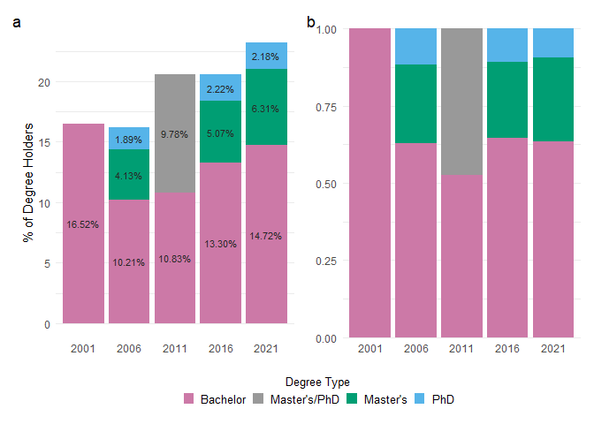<!-- -->


________________________________________________________________________________
## 4. Review of Degree Population Data \

The story type I think I've somehow followed incidentally is the **"Action-Background-Development-Climax-Ending" format:** \

1. **Action (Data Background):** Albeit a sad and uninteresting opening, the particular reason in which this city was selected was due to the parameters that were set for this assignment. The first and initial thought I had related to this geographic location was that I knew of three MSc or PhD students who were living there at the time during my travels. A quick Google search trying to determine something of interest about this region didn't... turn up as much as I had hoped. One piece of information, however, definitely caught my eye: that Kingston, ON apparently had the highest PhD holders per capita in Canada. Cue the 'action' for this story line type. This combined with my only thought or opinion on the city matched perfectly: education. Thus, the investigation into (GG606) PhD studies was born.

2. **Background (Data Context):** Taking this step somewhat literally... While I knew what I wanted to look at in general, I had to figure out exactly *what* I wanted to look at. I searched for any `cancensus` vectors accessible to me that had any general relation to the topic of 'education' and I was somewhat satisfied with what I found. As was touched on earlier in Section 3, I wanted to know when this increase in PhD holders occurred. If it this came from local resident populations, who would be included within the permanent resident census data, it would be interesting to note whether these degrees increased with post-secondary education popularity throughout the region. This must first relate to the general overarching question of do we see more and more people throughout time getting higher and higher levels of education? My first task was to look at the popularity of bachelor degrees over time, which might lead to eventual PhDs who then continue to stay within the area. This then led to my second main question, which was do we see a corresponding increase in PhDs appearing throughout time as well? Has there been an increasing amount of people with bachelor degrees being granted, then into PhDs? Or do we think that we have external visitors coming to complete their research?  

3. **Development/Climax (Data Analysis):** \
Q1: Do we see more and more people throughout time within this region getting higher and higher levels of education? \
-	Yes. The stacked bar plot from census years 2006 to 2021 very clearly shows an overall 4.51% increase in bachelor’s degrees granted within the population in the Kingston, ON CSD region. There appears to be a dramatic 'change' in the percentage of the population who obtained bachelor’s degrees granted from 2001 to 2006. However, we cannot necessarily include the data from 2001 as there was no clear distinction on whether these values include bachelor’s degrees alone, just that they are retained within this education vector commencing at this level. We do not truly know the exact amount of the population that held a bachelor, master, or PhD during this time since all categories of post-secondary education are lumped together. It could very likely be that the other graduate level degree types bulk up this number. I would argue, based on additional bachelor’s degree census data, that the percentage of the population with a bachelor degree might be similar to that of 2006 based on loose overall degree trends. Based on [Queen’s enrollment data,](https://www.queensu.ca/planningandbudget/irp/institutional-data/student/enrolment) undergraduate student populations have increased from 2001-2021 by 73.4% and graduate student populations by 152%.. which is a lot. This also doesn’t include enrollment data from St. Lawrence (only bachelor’s degrees) or the Royal Military College of Canada (bachelor, master, and PhDs). However, we don’t know with this current level of data who is local and who has moved to the area (excluded from census), nor do these numbers necessarily result in granted degrees. 
-	The DA geospatial data returns some interesting insights too. While the percentage of the overall population that hold a bachelor degree is consistent, when plotted within each DA we see a different pattern. The highest percentage of the population with bachelor’s degrees is often within the downtown core or suburban heavy area of the district. This makes sense, as people who need to commute to jobs (and need those degrees) are situated. However, from 2006 to 2021 we actually begin to see an increase in the proportion of the population who live rurally holding bachelor degrees. This might be attributed to a couple of things i.) further urban sprawl and development or ii.) the increase in accessibility of obtaining a bachelor’s degree or maintaining a career during/post COVID-19 when most work was online. Food for thought. No area within any census year had a higher bachelor degree holding percentage of 43% regardless of DA location (2006: 35%, 2011: 43%, 2016: 32%, 2021: 37%). 
-	We also see an increase in the number of people who held a master’s (2.18%) and PhD (0.29%) degree between 2006 and 2021. Again, in the 2011 census year we are unable to distinguish the difference in master’s or PhDs as there were no separate category options to differentiate between graduate study levels. However, overall while more of the population seem to pursue higher and higher levels of education (bachelor degree up) the proportion of each education level stays consistent throughout time (e.g., the amount of master’s degrees present in 2006 are similar if not the same in 2016 and 2021). Just because someone gets a master’s degree does not mean that they will go onto a PhD, but this might also counterbalance individuals who roll over into a PhD from their bachelor’s degree. While these percentages may appear small, it is important to remember that these values reflect the proportion of individuals within the entire region… 50,000 master’s degrees might seem like a lot, but in relation to 1 million people this only equates to 5%. In general, the proportion of all degree level types being granted or held are steadfast between each census year. This leads us to the next question.

Q2: Do we see a corresponding increase in PhDs appearing throughout time as well? Has there been an increasing amount of people with bachelor degrees being granted, that then translate into PhDs? \

-	No. As was discussed in the previous question, while the percentage of the population who hold PhDs does slightly increase over time, this does not necessarily translate into the amount of PhDs being pursued based on bachelor degree rates alone.  Master’s and PhDs over time seem rather consistent with the overall population, despite their slight increases, whereas bachelor degree frequency does increase. This seems to make sense with the change in demands from workforce employers who typically mandate that a bachelor degree level or higher be required for junior or entry level jobs. \
-	Geospatial data for master’s and PhDs is much more difficult to discern since they are less populous, and there is the amalgamation of degree types in 2011. Overall, PhDs visually on this spatial scale appear to not differ much- we would need to adjust for a segregated scale with brighter intensities. However, master’s degrees appear to follow a similar trend as the bachelor degree level, in that the more southern area DAs have more people that hold a master’s degree. In general, the highest percentage of master’s degree holders were as follows: 26%, 45.2%, 28.9%, 53.7% from 2006-2021 (locations variable). Groupings have also been corrected to include and reflect those people over the age of 65 in latter census years who hold these degree types too. This also makes me wonder about migration between regions, or out of the CSD entirely. I once knew a head scientist (BI-III) that said, “Rarely do the people at the top with PhDs get to stay in the same city that they were born in.” By this he meant that often PhD candidates are able to migrate to locations that specialize in topics of interest relative to the region, which they will then often stay there long term (ex. Arctic work is common in Manitoba so there are related PhD opportunities there and subsequent jobs). \


4. **Ending (Data Resolution):**
- Overall, while each level of post-secondary degree type (bachelor, master, PhD) does increase with each census year, only bachelor degrees slightly increase in popularity per capita over time, whilst graduate studies (both the master's and PhD levels) remain consistent with Kingston's population over time. We see the overall geographic region become 'more' educated further away from the downtown core thanks to bachelor degree popularity, but this does not have an apparent correlation to master or PhD popularity here. 
- This data was riddled with data gaps or holes, plus needed much more additional analysis or data being pulled in order to formulate a much more thorough story or investigation. Also, clearer and more specific questions would need to be investigated (ex. what does education overall look like? Are there more popular majors that have developed post world events?) to further develop the analysis. While a clickbait-y and catchy tag line from 2009 (that's right.. that claim was made from data prior to 2009) led to a promising data analysis, we would need to gather more data across more regions to be able to attest to this. 


________________________________________________________________________________
## 5. Concluding Comments and Thoughts \

#### 5.1 Notable Lessons from Mr. Wilke \

1. The chloropleth maps used to visualize the change in proportion of individuals who held a bachelor, master's, or PhD degree from 2001-2021 were done so based on a few of Wilke's comments on data visualization. Specifically:
- Actually, [Figure 4.4 and Figure 4.6](https://clauswilke.com/dataviz/color-basics.html) were of great inspiration to me, as they gave me the idea of the chloropleth rather than attempting a heat map format (population density). I also very much liked the idea of using percentage over population density because no matter how many people there actually were within a DA overtime it kept the comparison consistent. If I were to go via the density route, I would have done a heat map instead (xx degrees/100 people)- also inspired by Wilke. I think I just really wanted the two types to be easily comparable, even though with density it too is dependent on total resident populations and not just simple counts. 
- Figures 4.4 and 4.6 also got me trying to use diverging colour palettes (PiYG), which I thought was a good idea, but the data here seemed... ill fitted for it. I did, however, learn about how many mistakes I was making by selecting somewhat non-monochromatic colour palettes, or [inappropriately using colour within figures...](https://clauswilke.com/dataviz/color-pitfalls.html) this can be fact-checked from my last assignment even. I also paid more attention to the colour scales I *was* using for colour deficiency. In these figures I ended up going with a sequential scale because they, ["will generally not cause any problems for people with color-vision deficiency."](https://clauswilke.com/dataviz/color-pitfalls.html)
- I got the 'a-okay' from Wilke to use [lighter colours to highlight higher intensities](https://clauswilke.com/dataviz/geospatial-data.html) within chloropleth maps, so long as the background was dark. This is true for the inverse as well. Dark backgrounds were stated as being okay, should the graphic be viewed online rather than in traditional print. Thanks, Wilke #darkness4ever.  
- The omission of figure titles and [axis labels](https://clauswilke.com/dataviz/figure-titles-captions.html) when they are very apparent, much like the apparent coordinate systems being used here. As he states, if the image is not a standalone then it does not require a header title. However, these figures also fail to include a sufficient figure title within the caption within R.
- One thing I did keep were the background grid lines to help, ["frame the plot and keep it as a single visual unit"](https://clauswilke.com/dataviz/balance-data-context.html) rather than have it float away into the darkness of the black abyss-y background. Even on a light coloured background, I disliked the total openness of [certain cancensus plots](https://mountainmath.github.io/cancensus/articles/Making_maps_with_cancensus.html). I did darken the grid lines to not have them be overpowering and rather work with my colour choices, just as Wilke says. At least this was the attempt at doing so. 
- One of the many things I actually do regret not going through with is not creating more explicit percentage categories (ex: 0-25%, 26-50%, etc.) in order to make the coloured DAs more legible. However, it just... appeared off? Also, since there were so many DAs with a very little proportion of 50% or more during my first few plots I got scared off of doing it. \


2. The comparison of bachelor, master's, and PhD degrees over time was done so based on these Wilke comments:
- Initially I had wanted to do a heat map but in my head there would only have been five x-axis sections (years 2001-2021) and three y-axis sections (BSc, MSc, PhD levels), which would have given us a choppy and unclear visual of how many individuals held each degree type over time, plus it just didn't make sense. I then wanted to show proportion change in another way: classic case of [bar charts](https://clauswilke.com/dataviz/visualizing-proportions.html) of which stacked ones were okay-ed by Wilke when there are only two comparable variables (bachelor and PhD). This makes any changes or patterns more apparent especially over a constant variable, rather than attempting to distinguish changes for a multitude of seemingly static variables. However, when I went back to include the Master's level data, I knew that I had to include the actual stacked values of each category in order to more accurately represent 
- I manually chose three colours for the bachelor/master's/PhD plots that were a.) in keeping with the previous geospatial data plots (i.e., the same “visual language”) that were generated to [keep overall plot harmony and unisense]() and b.) were still visible to anyone with [colour defiencies.](https://clauswilke.com/dataviz/redundant-coding.html#designing-legends-with-redundant-coding) These colours were actually three of the nine provided by Wilke in his manual colour palette (bachelor #CC79A7, master's #009E73. and PhD #56B4E9). 
- When constructing the `all_degree_proportions_fig3` facet plot I kept [alignments consistent and did not have to include any hack job labeling.](https://clauswilke.com/dataviz/multi-panel-figures.html) Here, 'a' and 'b' are clearly labelled and in an appropriate spot within the overall figure. 
- I tried to make these plots look clean but, as Wilke puts it, not having them 'float in space' meant that while I implemented the light minimalist theme, I also kept the [horizontal grey x-axis lines](https://clauswilke.com/dataviz/balance-data-context.html) to try and keep the plot(s) grounded since they also were in the "direction along which the numbers of interest vary."

What was perhaps the most frequently visited section was the one titled, ["Telling a story and making a point"](https://clauswilke.com/dataviz/telling-a-story.html) as I could a.) not really understand the Stephan Hawking example(s) and b.) really needed to think on how to tell a story with a point rather than just spew data- which is what I've done for all my data life. Kinda a good resource by Mr. Wilke. \   


#### 5.2 General Closing Comments: \
- The `cancensus` package information was extremely detailed and useful. It made figuring out how to access the data very clear and somewhat straightforward. So that was super nice and useful to have, especially since working with this data is truly... endless, wow. There are millions and millions of things to look at, compute, code and design for. Great data set without any limitations (except API rates), but one would have to have a fairly clear picture or idea of where to go with the data. I personally started off waaaay too large of any overall analysis that I wanted to do, which made this assignment seem very overwhelming, so I had to dramatically scale back.
- I don't know why the `sf` plots for the Kingston region changed between 2006-2016 and seems to not account for unchanging water bodies. Without much investigation into this, I'd assume that the geospatial data for these years simply smushed these DA locations together without leaving an absence for landmarks. It makes the plot less aesthetic and somewhat bothers me but I did not have the time to go back and troubleshoot this. 
- One thing I noticed was how frequently I switched from the Royal 'We' to the first person 'I' throughout the assignment. I suspect that it's because as I'm coding in the moment I am trying to discern to myself what it is that I am trying to do, but when trying to communicate that back to the masses I it switches. I do not know how to more readily combat this, so I apologize. 
- I felt like I was doing this assignment sometimes twice... once to meet the specified criteria, and a second time with a geographic location that I was familiar with (Winnipeg) to see what results were coming back so as to understand the equivalent for the city I didn't know. I feel like one would return something more thorough if they could work within whatever chosen region because the investigation would be more self explanatory. But alas, this is a good lesson on the challenges of 'unknown' data.
- Holy hell, do I ever get the whole 'making functions' point. When I had to create the master's level data all of a sudden copying and editing those *maaasive* chunks of code was horrid and so easy to make a mistake. Someone would have to go back, edit the error then edit all of those chunks again. Point = understood. 
- Despite some common troubleshooting issues, this data actually did not cause me a lot of grief (well maintained?) and I actually really did enjoy myself. If this was a data set that one had to work with for an undisclosed amount of time I don't think that I would complain. Code on, bros (no cry)! :)


________________________________________________________________________________
## 6. Appendix \
 
#### 6.1 Percentage of Bachelor Degree Holders 2001-2021 \
Here, the five census plots from 2001-2021 for the total percent of bachelor degrees held within Kingston, ON DAs are located as stills for viewing.

```r
#the geographic region was too large with any of the other three CSD regions, rendering it EXTREMELY difficult to see anything above 40% (telling), so had to only keep the Kingston DAs.. oh well.
CA01_bachelor_fig=CA01_bachelor %>%
  filter(region_name=="Kingston") %>%  
#Generate the plot:  
  ggplot() +
  geom_sf(aes(fill=percentage)) +                       #make data plot by %
  scale_fill_distiller(name="Bachelor Degree Holders %",
                       palette="BuPu",
                       limits=c(0, 100)) +            #keep scale from 0-100%
#Plot aesthetics:  
  theme_minimal() +
  theme(plot.background=element_rect(fill="black"),        #make figure background dark
        panel.grid.major=element_line(colour="#262626")) + #colourlat long grid lines
  guides(fill=guide_colourbar(barwidth=10, barheight=0.5,    #edit key size here bc bar
                             direction="horizontal", title.position="top", 
                             title.hjust=0.3)) +        
  theme(legend.position="bottom", legend.title=element_text(size=10, colour="white"), 
        legend.text=element_text(size=11, colour="white")) +     #edit legend themes    
#Generate labels:  
geom_text(x= -76.65, y=44.47, label="2001", colour="white", size=7)
  

print(CA01_bachelor_fig)
```

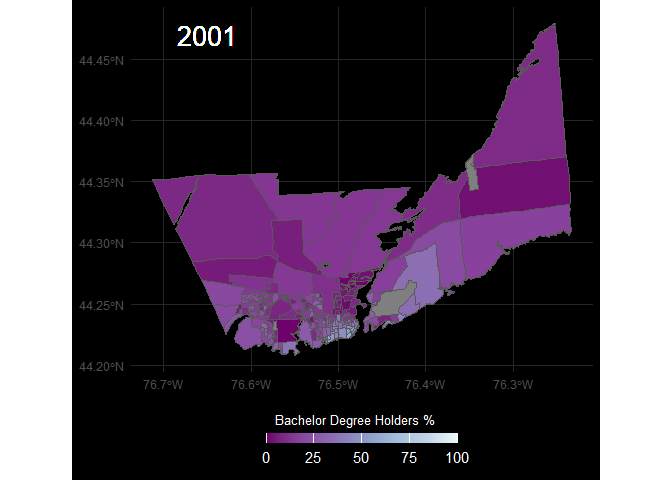<!-- -->

```r
ggsave(here("03_figures/census_geospatial_data", "bach_CA01.png"), CA01_bachelor_fig,
       width=190, height=120, units="mm")
```


```r
CA06_bachelor_fig=CA06_bachelor %>%
  filter(region_name=="Kingston") %>%  
#Generate the plot:  
  ggplot() +
  geom_sf(aes(fill=percentage)) +                       #make data plot by %
  scale_fill_distiller(name="Bachelor Degree Holders %",
                       palette="BuPu",
                       limits=c(0, 100)) +            #keep scale from 0-100%
#Plot aesthetics:  
  theme_minimal() +
  theme(plot.background=element_rect(fill="black"),        #make figure background dark
        panel.grid.major=element_line(colour="#262626")) + #colourlat long grid lines
  guides(fill=guide_colourbar(barwidth=10, barheight=0.5,    #edit key size here bc bar
                             direction="horizontal", title.position="top", 
                             title.hjust=0.3)) +        
  theme(legend.position="bottom", legend.title=element_text(size=10, colour="white"), 
        legend.text=element_text(size=11, colour="white")) +     #edit legend themes    
#Generate labels:  
geom_text(x= -76.65, y=44.47, label="2006", colour="white", size=7)
  

print(CA06_bachelor_fig)
```

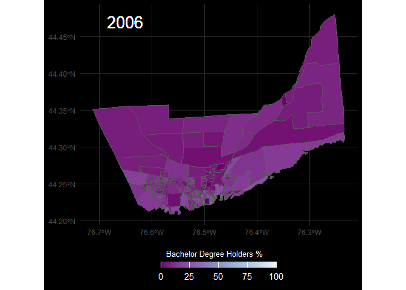<!-- -->


```r
CA11_bachelor_fig=CA11_bachelor %>%
  filter(region_name=="Kingston") %>%  
#Generate the plot:  
  ggplot() +
  geom_sf(aes(fill=percentage)) +                       #make data plot by %
  scale_fill_distiller(name="Bachelor Degree Holders %",
                       palette="BuPu",
                       limits=c(0, 100)) +            #keep scale from 0-100%
#Plot aesthetics:  
  theme_minimal() +
  theme(plot.background=element_rect(fill="black"),        #make figure background dark
        panel.grid.major=element_line(colour="#262626")) + #colourlat long grid lines
  guides(fill=guide_colourbar(barwidth=10, barheight=0.5,    #edit key size here bc bar
                             direction="horizontal", title.position="top", 
                             title.hjust=0.3)) +        
  theme(legend.position="bottom", legend.title=element_text(size=10, colour="white"), 
        legend.text=element_text(size=11, colour="white")) +     #edit legend themes    
#Generate labels:  
geom_text(x= -76.65, y=44.47, label="2011", colour="white", size=7)
  

print(CA11_bachelor_fig)
```

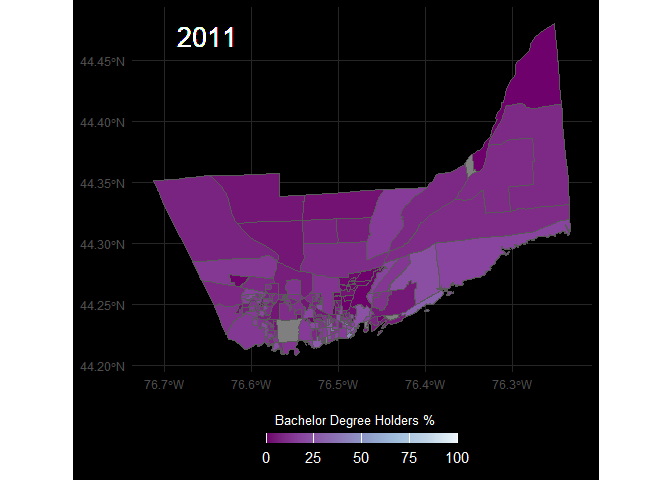<!-- -->


```r
CA16_bachelor_fig=CA16_bachelor %>%
  filter(region_name=="Kingston") %>%  
#Generate the plot:  
  ggplot() +
  geom_sf(aes(fill=percentage)) +                       #make data plot by %
  scale_fill_distiller(name="Bachelor Degree Holders %",
                       palette="BuPu",
                       limits=c(0, 100)) +            #keep scale from 0-100%
#Plot aesthetics:  
  theme_minimal() +
  theme(plot.background=element_rect(fill="black"),        #make figure background dark
        panel.grid.major=element_line(colour="#262626")) + #colourlat long grid lines
  guides(fill=guide_colourbar(barwidth=10, barheight=0.5,    #edit key size here bc bar
                             direction="horizontal", title.position="top", 
                             title.hjust=0.3)) +        
  theme(legend.position="bottom", legend.title=element_text(size=10, colour="white"), 
        legend.text=element_text(size=11, colour="white")) +     #edit legend themes    
#Generate labels:  
geom_text(x= -76.65, y=44.47, label="2016", colour="white", size=7)
  

print(CA16_bachelor_fig)
```

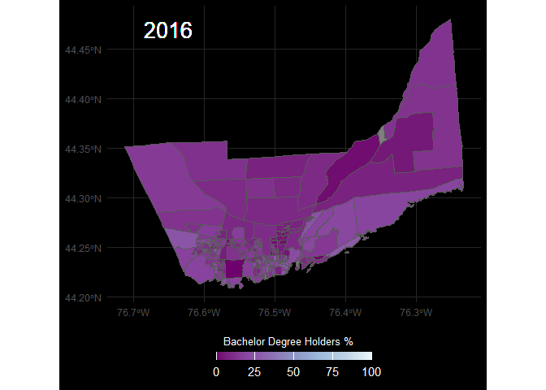<!-- -->

*Side note: So, in 2021 they changed the way in which the `region_name` column was organized from simply just stating the name to a numeric form. I had to go back to the `CA21_ed_CSD` data frame where the `geo_uid` column corresponded to four values (3510005, 3510010, 3510020, 3511005) that were assigned to Frontenac Islands, Kingston, South Frontenac, and Loyal CSDs. Under the `csd_uid` column in `CA21_bachelor` there were only these four values returned, and moving forward I am assuming that these correspond to those locations. Everything appears right, so. Yay.*  


```r
#`region_name` changes here from the actual alphabetic name to numeric codes...
CA21_bachelor_fig=CA21_bachelor %>%
  filter(csd_uid=="3510010") %>%  
#Generate the plot:  
  ggplot() +
  geom_sf(aes(fill=percentage)) +                       #make data plot by %
  scale_fill_distiller(name="Bachelor Degree Holders %",
                       palette="BuPu",
                       limits=c(0, 100)) +            #keep scale from 0-100%
#Plot aesthetics:  
  theme_minimal() +
  theme(plot.background=element_rect(fill="black"),        #make figure background dark
        panel.grid.major=element_line(colour="#262626")) + #colourlat long grid lines
  guides(fill=guide_colourbar(barwidth=10, barheight=0.5,    #edit key size here bc bar
                             direction="horizontal", title.position="top", 
                             title.hjust=0.3)) +        
  theme(legend.position="bottom", legend.title=element_text(size=10, colour="white"), 
        legend.text=element_text(size=11, colour="white")) +     #edit legend themes    
#Generate labels:  
geom_text(x= -76.65, y=44.47, label="2021", colour="white", size=7)
  

print(CA21_bachelor_fig)
```

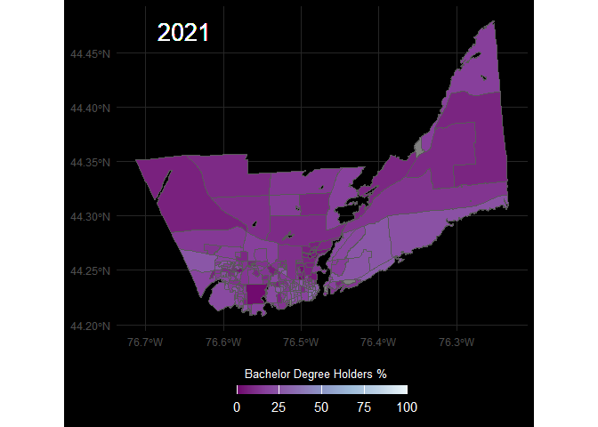<!-- -->

```r
ggsave(here("03_figures/census_geospatial_data", "bach_CA21.png"), CA21_bachelor_fig,
       width=190, height=120, units="mm")
```


#### 6.2 Percentage of Master's Degree Holders 2001-2021 \
Here, the five census plots from 2001-2021 for the total percent of master's degrees held within Kingston, ON DAs are located as stills for viewing.


```r
CA01_msc_fig=CA01_bachelor %>%     #keep same data frame because same data...
  filter(region_name=="Kingston") %>%  
#Generate the plot:  
  ggplot() +
  geom_sf(aes(fill=percentage)) +                       #make data plot by %
  scale_fill_distiller(name="Master's Degree Holders %",
                       palette="BuGn",                 #change colour scale new var
                       limits=c(0, 100)) +            #keep scale from 0-100%
#Plot aesthetics:  
  theme_minimal() +
  theme(plot.background=element_rect(fill="black"),        #make figure background dark
        panel.grid.major=element_line(colour="#262626")) + #colourlat long grid lines
  guides(fill=guide_colourbar(barwidth=10, barheight=0.5,    #edit key size here bc bar
                             direction="horizontal", title.position="top", 
                             title.hjust=0.3)) +        
  theme(legend.position="bottom", legend.title=element_text(size=10, colour="white"), 
        legend.text=element_text(size=11, colour="white")) +     #edit legend themes    
#Generate labels:  
geom_text(x= -76.65, y=44.47, label="2001", colour="white", size=7)
  
print(CA01_msc_fig)
```

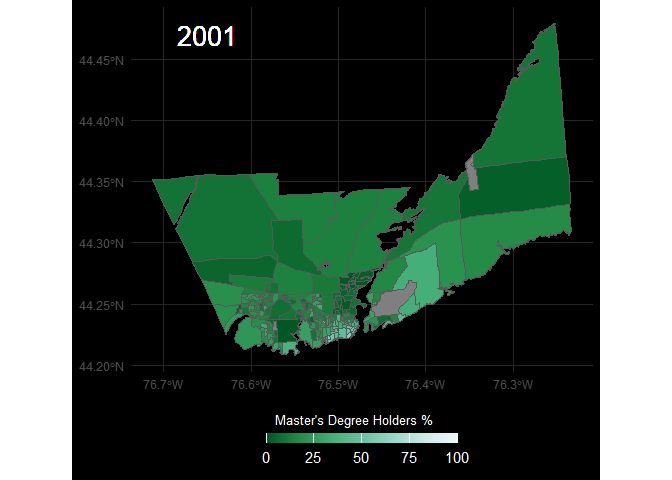<!-- -->

```r
ggsave(here("03_figures/census_geospatial_data", "msc_CA01.png"), CA01_msc_fig,
       width=190, height=120, units="mm")
```


```r
CA06_msc_fig=CA06_msc %>%
  filter(region_name=="Kingston") %>%  
#Generate the plot:  
  ggplot() +
  geom_sf(aes(fill=percentage)) +                       #make data plot by %
  scale_fill_distiller(name="Master's Degree Holders %",
                       palette="BuGn",
                       limits=c(0, 100)) +            #keep scale from 0-100%
#Plot aesthetics:  
  theme_minimal() +
  theme(plot.background=element_rect(fill="black"),        #make figure background dark
        panel.grid.major=element_line(colour="#262626")) + #colourlat long grid lines
  guides(fill=guide_colourbar(barwidth=10, barheight=0.5,    #edit key size here bc bar
                             direction="horizontal", title.position="top", 
                             title.hjust=0.3)) +        
  theme(legend.position="bottom", legend.title=element_text(size=10, colour="white"), 
        legend.text=element_text(size=11, colour="white")) +     #edit legend themes    
#Generate labels:  
geom_text(x= -76.65, y=44.47, label="2006", colour="white", size=7)
  
print(CA06_msc_fig)
```

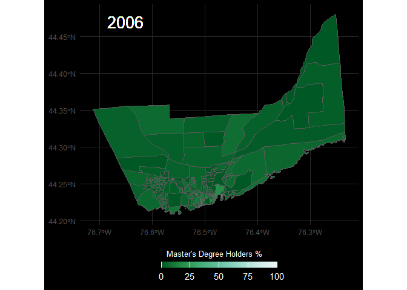<!-- -->


```r
CA11_msc_fig=CA11_msc %>%
  filter(region_name=="Kingston") %>%  
#Generate the plot:  
  ggplot() +
  geom_sf(aes(fill=percentage)) +                       #make data plot by %
  scale_fill_distiller(name="Master's Degree Holders %",
                       palette="BuGn",
                       limits=c(0, 100)) +            #keep scale from 0-100%
#Plot aesthetics:  
  theme_minimal() +
  theme(plot.background=element_rect(fill="black"),        #make figure background dark
        panel.grid.major=element_line(colour="#262626")) + #colourlat long grid lines
  guides(fill=guide_colourbar(barwidth=10, barheight=0.5,    #edit key size here bc bar
                             direction="horizontal", title.position="top", 
                             title.hjust=0.3)) +        
  theme(legend.position="bottom", legend.title=element_text(size=10, colour="white"), 
        legend.text=element_text(size=11, colour="white")) +     #edit legend themes    
#Generate labels:  
geom_text(x= -76.65, y=44.47, label="2011", colour="white", size=7)
  
print(CA11_msc_fig)
```

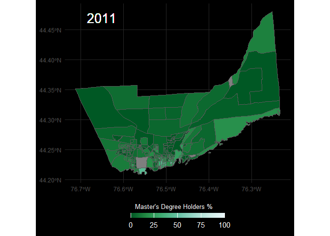<!-- -->

*Side note: in 2011 the census data for those with a degree type over the age of 15 does not specify between the master's and PhD level. These data are therefore the same for the PhD figure.*


```r
CA16_msc_fig=CA16_msc %>%
  filter(region_name=="Kingston") %>%  
#Generate the plot:  
  ggplot() +
  geom_sf(aes(fill=percentage)) +                       #make data plot by %
  scale_fill_distiller(name="Master's Degree Holders %",
                       palette="BuGn",
                       limits=c(0, 100)) +            #keep scale from 0-100%
#Plot aesthetics:  
  theme_minimal() +
  theme(plot.background=element_rect(fill="black"),        #make figure background dark
        panel.grid.major=element_line(colour="#262626")) + #colourlat long grid lines
  guides(fill=guide_colourbar(barwidth=10, barheight=0.5,    #edit key size here bc bar
                             direction="horizontal", title.position="top", 
                             title.hjust=0.3)) +        
  theme(legend.position="bottom", legend.title=element_text(size=10, colour="white"), 
        legend.text=element_text(size=11, colour="white")) +     #edit legend themes    
#Generate labels:  
geom_text(x= -76.65, y=44.47, label="2016", colour="white", size=7)
  
print(CA16_msc_fig)
```

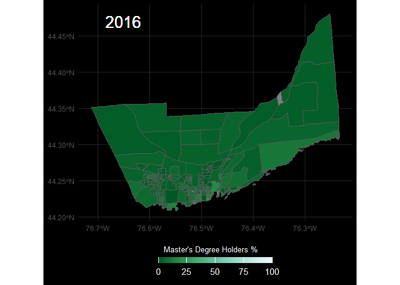<!-- -->


```r
#`region_name` changes here from the actual alphabetic name to numeric codes...
CA21_msc_fig=CA21_msc %>%
  filter(csd_uid=="3510010") %>%  
#Generate the plot:  
  ggplot() +
  geom_sf(aes(fill=percentage)) +                       #make data plot by %
  scale_fill_distiller(name="Master's Degree Holders %",
                       palette="BuGn",
                       limits=c(0, 100)) +            #keep scale from 0-100%
#Plot aesthetics:  
  theme_minimal() +
  theme(plot.background=element_rect(fill="black"),        #make figure background dark
        panel.grid.major=element_line(colour="#262626")) + #colourlat long grid lines
  guides(fill=guide_colourbar(barwidth=10, barheight=0.5,    #edit key size here bc bar
                             direction="horizontal", title.position="top", 
                             title.hjust=0.3)) +        
  theme(legend.position="bottom", legend.title=element_text(size=10, colour="white"), 
        legend.text=element_text(size=11, colour="white")) +     #edit legend themes    
#Generate labels:  
geom_text(x= -76.65, y=44.47, label="2021", colour="white", size=7)
  
print(CA21_msc_fig)
```

<!-- -->


#### 6.2 Percentage of PhD Degree Holders 2001-2021 \
Here, the five census plots from 2001-2021 for the total percent of doctoral degrees held within Kingston, ON DAs are located as stills for viewing.


```r
CA01_phd_fig=CA01_bachelor %>%     #keep same data frame because same data...
  filter(region_name=="Kingston") %>%  
#Generate the plot:  
  ggplot() +
  geom_sf(aes(fill=percentage)) +                       #make data plot by %
  scale_fill_distiller(name="PhD Degree Holders %",
                       palette="GnBu",                 #change colour scale new var
                       limits=c(0, 100)) +            #keep scale from 0-100%
#Plot aesthetics:  
  theme_minimal() +
  theme(plot.background=element_rect(fill="black"),        #make figure background dark
        panel.grid.major=element_line(colour="#262626")) + #colourlat long grid lines
  guides(fill=guide_colourbar(barwidth=10, barheight=0.5,    #edit key size here bc bar
                             direction="horizontal", title.position="top", 
                             title.hjust=0.3)) +        
  theme(legend.position="bottom", legend.title=element_text(size=10, colour="white"), 
        legend.text=element_text(size=11, colour="white")) +     #edit legend themes    
#Generate labels:  
geom_text(x= -76.65, y=44.47, label="2001", colour="white", size=7)
  
print(CA01_phd_fig)
```

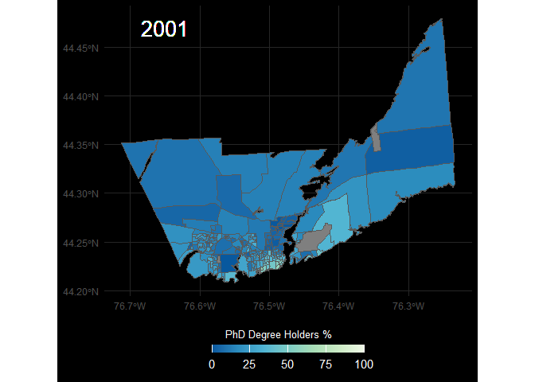<!-- -->


```r
ggsave(here("03_figures/census_geospatial_data", "phd_CA01.png"), CA01_phd_fig,
       width=190, height=120, units="mm")
```


```r
CA06_phd_fig=CA06_phd %>%
  filter(region_name=="Kingston") %>%  
#Generate the plot:  
  ggplot() +
  geom_sf(aes(fill=percentage)) +                       #make data plot by %
  scale_fill_distiller(name="PhD Degree Holders %",
                       palette="GnBu",
                       limits=c(0, 100)) +            #keep scale from 0-100%
#Plot aesthetics:  
  theme_minimal() +
  theme(plot.background=element_rect(fill="black"),        #make figure background dark
        panel.grid.major=element_line(colour="#262626")) + #colourlat long grid lines
  guides(fill=guide_colourbar(barwidth=10, barheight=0.5,    #edit key size here bc bar
                             direction="horizontal", title.position="top", 
                             title.hjust=0.3)) +        
  theme(legend.position="bottom", legend.title=element_text(size=10, colour="white"), 
        legend.text=element_text(size=11, colour="white")) +     #edit legend themes    
#Generate labels:  
geom_text(x= -76.65, y=44.47, label="2006", colour="white", size=7)
  
print(CA06_phd_fig)
```

<!-- -->


```r
CA11_phd_fig=CA11_phd %>%
  filter(region_name=="Kingston") %>%  
#Generate the plot:  
  ggplot() +
  geom_sf(aes(fill=percentage)) +                       #make data plot by %
  scale_fill_distiller(name="PhD Degree Holders %",
                       palette="GnBu",
                       limits=c(0, 100)) +            #keep scale from 0-100%
#Plot aesthetics:  
  theme_minimal() +
  theme(plot.background=element_rect(fill="black"),        #make figure background dark
        panel.grid.major=element_line(colour="#262626")) + #colourlat long grid lines
  guides(fill=guide_colourbar(barwidth=10, barheight=0.5,    #edit key size here bc bar
                             direction="horizontal", title.position="top", 
                             title.hjust=0.3)) +        
  theme(legend.position="bottom", legend.title=element_text(size=10, colour="white"), 
        legend.text=element_text(size=11, colour="white")) +     #edit legend themes    
#Generate labels:  
geom_text(x= -76.65, y=44.47, label="2011", colour="white", size=7)
  
print(CA11_phd_fig)
```

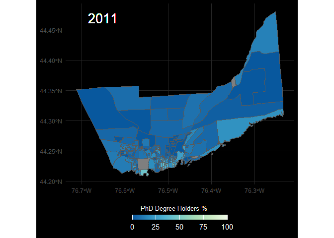<!-- -->

```r
ggsave(here("03_figures/census_geospatial_data", "phd_CA11.png"), CA11_phd_fig,
       width=190, height=120, units="mm")
```


```r
CA16_phd_fig=CA16_phd %>%
  filter(region_name=="Kingston") %>%  
#Generate the plot:  
  ggplot() +
  geom_sf(aes(fill=percentage)) +                       #make data plot by %
  scale_fill_distiller(name="PhD Degree Holders %",
                       palette="GnBu",
                       limits=c(0, 100)) +            #keep scale from 0-100%
#Plot aesthetics:  
  theme_minimal() +
  theme(plot.background=element_rect(fill="black"),        #make figure background dark
        panel.grid.major=element_line(colour="#262626")) + #colourlat long grid lines
  guides(fill=guide_colourbar(barwidth=10, barheight=0.5,    #edit key size here bc bar
                             direction="horizontal", title.position="top", 
                             title.hjust=0.3)) +        
  theme(legend.position="bottom", legend.title=element_text(size=10, colour="white"), 
        legend.text=element_text(size=11, colour="white")) +     #edit legend themes    
#Generate labels:  
geom_text(x= -76.65, y=44.47, label="2016", colour="white", size=7)
  
print(CA16_phd_fig)
```

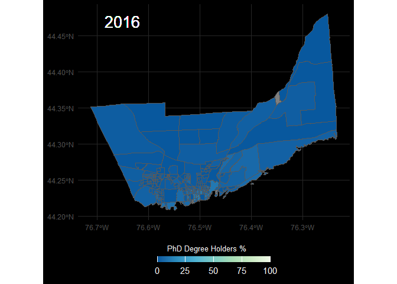<!-- -->

```r
ggsave(here("03_figures/census_geospatial_data", "phd_CA16.png"), CA16_phd_fig,
       width=190, height=120, units="mm")
```


```r
#`region_name` changes here from the actual alphabetic name to numeric codes...
CA21_phd_fig=CA21_phd %>%
  filter(csd_uid=="3510010") %>%  
#Generate the plot:  
  ggplot() +
  geom_sf(aes(fill=percentage)) +                       #make data plot by %
  scale_fill_distiller(name="PhD Degree Holders %",
                       palette="GnBu",
                       limits=c(0, 100)) +            #keep scale from 0-100%
#Plot aesthetics:  
  theme_minimal() +
  theme(plot.background=element_rect(fill="black"),        #make figure background dark
        panel.grid.major=element_line(colour="#262626")) + #colourlat long grid lines
  guides(fill=guide_colourbar(barwidth=10, barheight=0.5,    #edit key size here bc bar
                             direction="horizontal", title.position="top", 
                             title.hjust=0.3)) +        
  theme(legend.position="bottom", legend.title=element_text(size=10, colour="white"), 
        legend.text=element_text(size=11, colour="white")) +     #edit legend themes    
#Generate labels:  
geom_text(x= -76.65, y=44.47, label="2021", colour="white", size=7)
  
print(CA21_phd_fig)
```

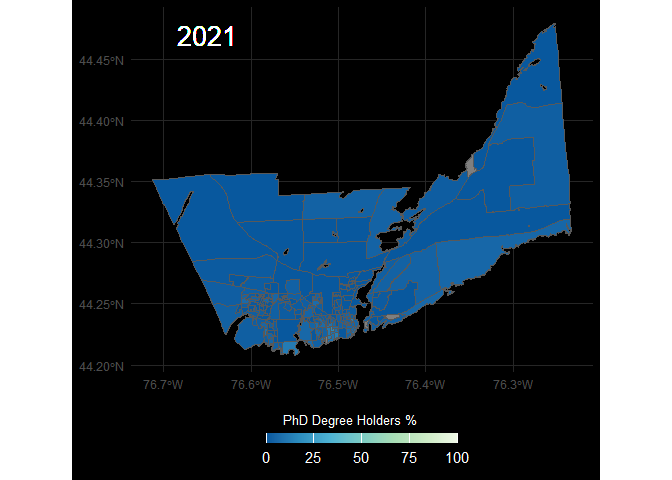<!-- -->


```r
ggsave(here("03_figures/census_geospatial_data", "phd_CA21.png"), CA21_phd_fig,
       width=190, height=120, units="mm")
```

